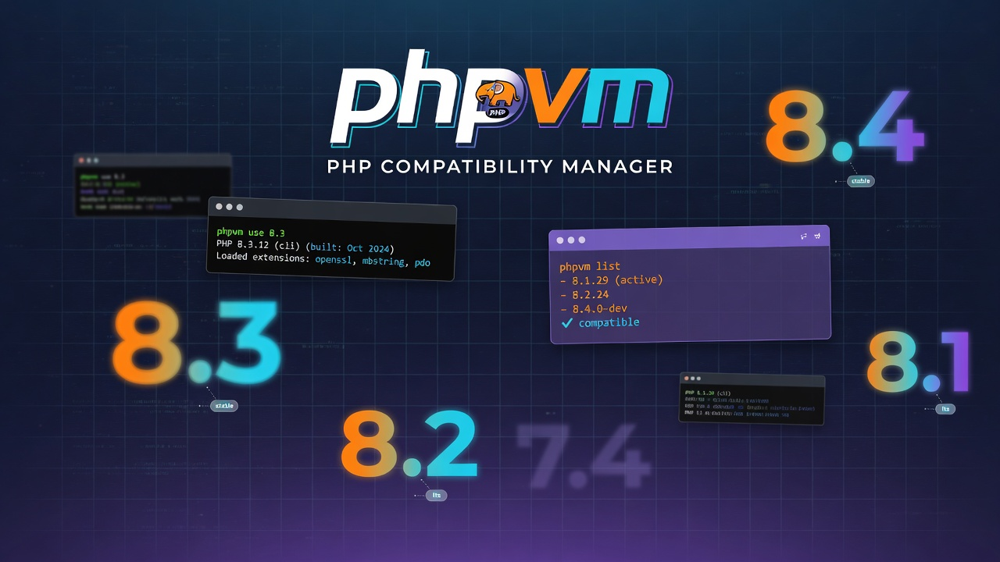

<p align="center">
  
</p>

# phpvm

**PHP Compatibility Manager**

The simple way to run and test your PHP applications against multiple real versions — without touching (or needing) your host PHP or Composer.

## Install

```bash
# One command (macOS + Linux)
curl -fsSL https://raw.githubusercontent.com/moyerdestroyer/phpvm/main/install.sh | bash
```

The installer places a standalone `phpvm` binary in `~/.local/bin` (customize with `PHPVM_INSTALL_DIR`).

- Requires only `curl`, `tar`, and `sha256sum`/`shasum` (standard on modern systems).
- Manual downloads and older versions: [GitHub Releases](https://github.com/moyerdestroyer/phpvm/releases)
- If you have Rust: `cargo install phpvm`

## Background

PHP developers routinely claim support for ranges like "PHP 8.1+". In practice they develop and test against a single version.

phpvm solves the compatibility problem:

- **Isolated runtimes**: each includes exact PHP + Composer + chosen extensions + php.ini
- **Host independence**: zero reliance on system PHP/Composer/extensions (a core design principle)
- **Reproducible**: manifest-driven downloads with checksums. No local compilation for V1.
- Focused on verification: matrix testing, pre-release checks, project inspection.

## Quickstart

```bash
phpvm install 8.3 --profile=wordpress   # or laravel / minimal
phpvm run 8.3 php -v
phpvm run 8.3 composer install
phpvm matrix composer test
phpvm doctor
phpvm release-check

# Listing and inspection
phpvm ls
phpvm ls-remote
phpvm info 8.3

# Daily development (makes bare `php` and `composer` use a specific runtime)
# One-time setup (add to your shell rc):
#   eval "$(phpvm env)"
phpvm use 8.3          # switches the current shell immediately + persists
php -v
composer --version
```

See `phpvm --help` and subcommand help for options (including JSON output).

`phpvm use <version>` sets your active runtime persistently (like fnm). After the one-time `eval "$(phpvm env)"` in your rc file, `phpvm use 8.3` immediately updates the current shell (the shell function wrapper applies the changes) and persists for new terminals. Bare `php`/`composer` + per-minor global packages then work directly. For reproducible verification, still prefer the explicit `run` / `matrix` commands.

### Planned

- Per-project version + profile selection (e.g. a `.phpvm-version` file or using the existing project `.phpvm.toml`). See TODOs in `src/version.rs` (near `activate` / `print_env`). Any such mechanism should carry the full extension profile, not just a PHP version string.

## Update / Uninstall

Re-run the curl command above (or set `PHPVM_VERSION`).

To remove the binary: `rm ~/.local/bin/phpvm` (or use `PHPVM_UNINSTALL=1` with the installer).

Runtimes live separately in `~/.phpvm/` if you want to clean them too.

## Learn more

- [AGENTS.md](AGENTS.md) — contribution guide, architecture, and required checks
- [Project.md](Project.md) — full vision and design
- Primary workflows: `install`, `run`, `matrix`, `doctor`, `release-check`
